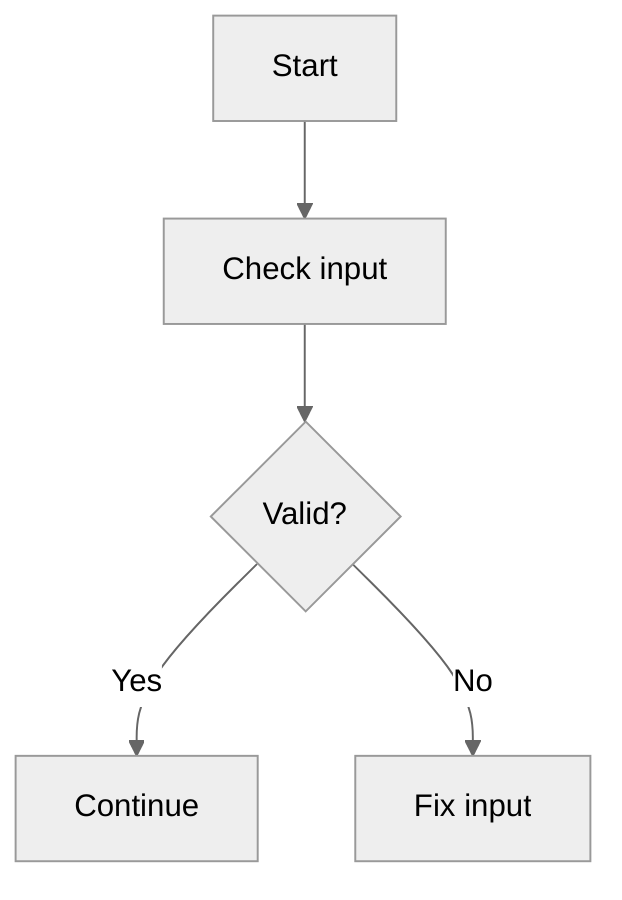

# Mermaid Lite Skill

Generate markdown output that includes the requested diagram. This skill does not install tools and does not run local rendering.

## Dependency Policy (mandatory)

- Never suggest or run dependency installation commands.
- Never run npm, npx, mmdc, pip, brew, apt, or similar setup commands for diagram rendering.
- Default deliverable is a fenced mermaid block.
- If user asks for PNG, PDF, or SVG export, clearly state this skill is text-only and provide copy-ready Mermaid source.

## Workflow

1. Detect intent and choose one chart type.
2. Apply default init policy (neutral for all figures unless user explicitly asks for special format).
3. Produce valid Mermaid syntax with minimal assumptions.
4. Return output in the required structure.
5. Include quick edit tips.
6. Include a copy-ready fenced markdown block that contains the full response body.

## Chart Type Mapping

| User intent | Mermaid type | First line |
|---|---|---|
| process, workflow, decision | Flowchart | `flowchart TD` |
| interactions over time | Sequence | `sequenceDiagram` |
| entities and relationships | ER | `erDiagram` |
| classes and inheritance | Class | `classDiagram` |
| lifecycle and transitions | State | `stateDiagram-v2` |
| schedule and milestones | Gantt | `gantt` |
| percentages and composition | Pie | `pie` |
| branch/merge history | Git graph | `gitGraph` |
| experience steps | Journey | `journey` |
| concept hierarchy | Mindmap | `mindmap` |
| events over time | Timeline | `timeline` |

## Default Init Policy

Use this default for all Mermaid figures when no styling preference is requested:

```text
%%{init: {'theme': 'neutral'}}%%
```

Only when the user explicitly requests a special format/theme/style, use this preset:

```text
%%{init: {'theme': 'dark','themeVariables': {
    "primaryColor": "#2665fd",
    "primaryTextColor": "#dae2fd",
    "primaryBorderColor": "#2665fd",

    "secondaryColor": "#475569",
    "lineColor": "#475569",
    "defaultLinkColor": "#475569",

    "background": "#808286",
    "mainBkg": "#0b1326",
    "textColor": "#dae2fd",
    "titleColor": "#dae2fd",
    "edgeLabelBackground": "#0b1326",

    "errorBkgColor": "#2b1b22",
    "errorTextColor": "#ffb4ab",

    "fontFamily": "Inter",
    "fontSize": "16px"
  }}
}%%
```

User-provided init blocks always override defaults.

## Syntax Safety Checklist

Before final output, self-check:

- First line is the resolved init line, and the next line uses the selected Mermaid keyword.
- Node IDs do not contain spaces.
- Labels with special characters are quoted when needed.
- Arrow syntax is valid for the selected chart type.
- Flowchart includes direction (TD, LR, BT, or RL).

## Required Output Structure

Always return these sections in order:

1. `Diagram Type:`
2. `Mermaid Block:`
3. `Assumptions:`
4. `Quick Edit Tips:`
5. `Copy-Ready Markdown:`

Example structure:

Diagram Type: Flowchart

Mermaid Block:


Assumptions:
- Single path unless branches are requested.

Quick Edit Tips:
- Change `TD` to `LR` for left-to-right layout.

Copy-Ready Markdown:
````markdown
Diagram Type: Flowchart

Mermaid Block:


Assumptions:
- Single path unless branches are requested.

Quick Edit Tips:
- Change `TD` to `LR` for left-to-right layout.
````

## Handling export requests

When asked to export to PNG/PDF/SVG:

- State: "This skill is dependency-free and text-only, so it does not perform local rendering."
- Provide Mermaid source in a fenced block.
- Optionally offer a neutral note: "You can render this in any external tool or CI pipeline you already use."

## File naming guidance (only if user asks for filename)

- Use lowercase kebab-case names like `login-flow.mmd`.
- Keep extension aligned to content: `.mmd` for Mermaid source.

## What not to do

- Do not include installation instructions.
- Do not claim that an image file was generated.
- Do not add unrelated prose outside required sections unless user asks.
- Do not omit the `Copy-Ready Markdown` section.
