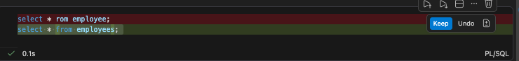

# Notebook Is What You Need

A SQL notebook can combine explanation, Oracle SQL execution, reusable script invocation, and shell commands in one workflow. This guide mirrors the accompanying `02Notebook_is_what_your_need.sqlnb` notebook.

## Auto Completion

Use a small `employees` table to demonstrate object creation, SQL authoring, and quick validation while working in a notebook.

### Create a Sample Table

```sql
CREATE TABLE employees (
    employee_id NUMBER PRIMARY KEY,
    first_name VARCHAR2(50),
    last_name VARCHAR2(50),
    email VARCHAR2(100),
    hire_date DATE,
    job_id VARCHAR2(10),
    salary NUMBER
);
```

The table is intentionally simple so that the focus remains on notebook authoring features rather than schema complexity.

### Search and Debug SQL

A notebook can hold an initial search prompt and a follow-up query while the SQL is being refined.

```sql
-- Search in employees
```

```sql
-- Debugged query
SELECT *
FROM employees;
```

This workflow makes it easy to move from an intention to an executable query and keep the correction close to the original attempt.

### Inspect the Table

Use the data dictionary to confirm that the table exists in the current database context.

```sql
SELECT owner, table_name
FROM all_tables
WHERE table_name = 'EMPLOYEES';
```

### Add Documentation or Visual Results

Markdown cells can document expected output, setup notes, screenshots, or diagrams.

```markdown

```

## Execute Three Kinds of Commands

A SQL notebook is not limited to direct queries. It can demonstrate three common execution styles:

1. Execute an external SQL script.
2. Run a shell command.
3. Execute direct SQL or PL/SQL.

### Execute External SQL Scripts

The `@` command runs SQL files from a clickable path. This is useful for reusing DDL, package calls, or setup scripts without copying their contents into the notebook.

```sql
@Script/AI_SQL_Developer/02Development_Zone/Oracle/ddl_dmployees.sql
@Script/AI_SQL_Developer/02Development_Zone/Oracle/get_name.sql
```

Example reference:

[GET_EMPLOYEE_DETAILS](~/Script/AI_SQL_Developer/02Development_Zone/Oracle/get_name.sql)

### Run Shell Commands

The `!` prefix runs an operating-system command from the notebook. This can help inspect files, run deployment helpers, or validate the surrounding environment before database execution.

```sql
!ssh user@remote_host "ls -l /home/user"
```

```sql
!ls
```

Use remote commands only with approved hosts and credentials.

### Run Direct SQL and PL/SQL

Return to database execution for a direct query or a stored procedure call.

```sql
SELECT *
FROM employees;
```

```sql
EXECUTE GET_EMPLOYEE_DETAILS(1);
```

This makes the notebook useful for interactively testing tables, stored procedures, and packaged routines while keeping the surrounding explanation close to the code.
