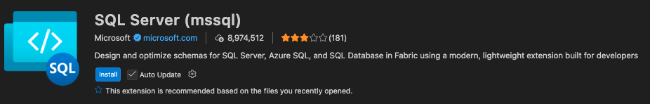
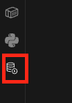
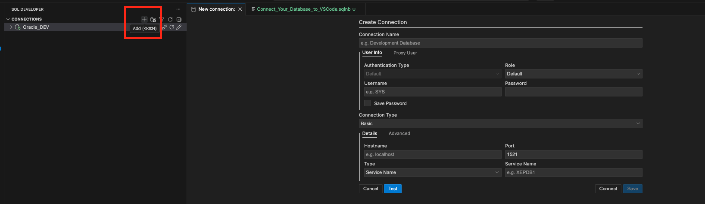
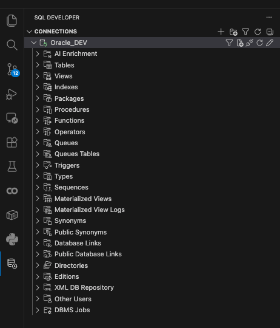

# Connect Your Database to VS Code

After installing VS Code, click **Extensions** to search for database extensions.

We recommend using the official extensions shown below:

## Recommended Extensions

- **Oracle**: Oracle SQL Developer Extension for VS Code  


- **MySQL / SQL Server**: SQL Server (mssql)  



In this guide, we use **Oracle SQL** as the example.

---

## Step 1: Open the Extension

After installing the Oracle extension, click it from the sidebar.



---

## Step 2: Create a Connection

After opening the extension, click the **"+" (plus icon)** to create a database connection.



---

## Step 3: Verify Connection

If you can see all database objects, it means you have successfully connected to your database.



---

## Step 4: Select Connection for Notebook

You need to select a connection in the **bottom-right corner of VS Code** before running notebooks.


---

## ⚠️ Important: Avoid Using SYS/SYSTEM

If you are using `SYS` or `SYSTEM`, it is recommended to create a new user to enable AI Enrichment features.

Otherwise, you may encounter this error:

```
AI Enrichment is not available on SYS or SYSTEM schemas due to potential conflicts during installation
```

---

## Step 5: Create a New User

Run the following SQL script (use `Ctrl + Alt + Enter` in SQL Notebook):

```sql
CREATE USER dev IDENTIFIED BY dev123;

GRANT CONNECT, RESOURCE TO dev;

ALTER USER dev QUOTA UNLIMITED ON USERS;
```

---

## ✅ Summary

- Install the correct database extension  
- Create and verify your connection  
- Select the connection before running notebooks  
- Avoid SYS/SYSTEM for development  
- Use a dedicated user for AI-related features  
